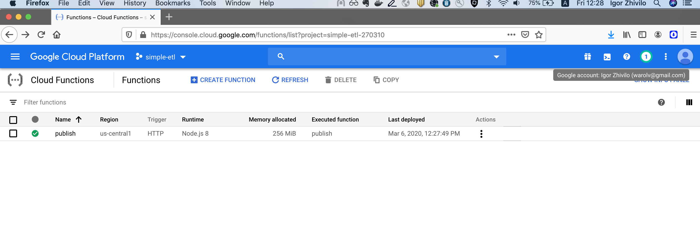
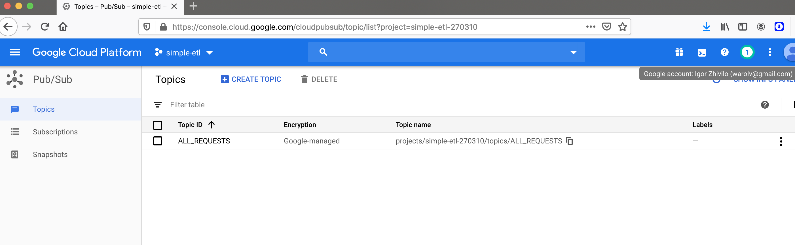
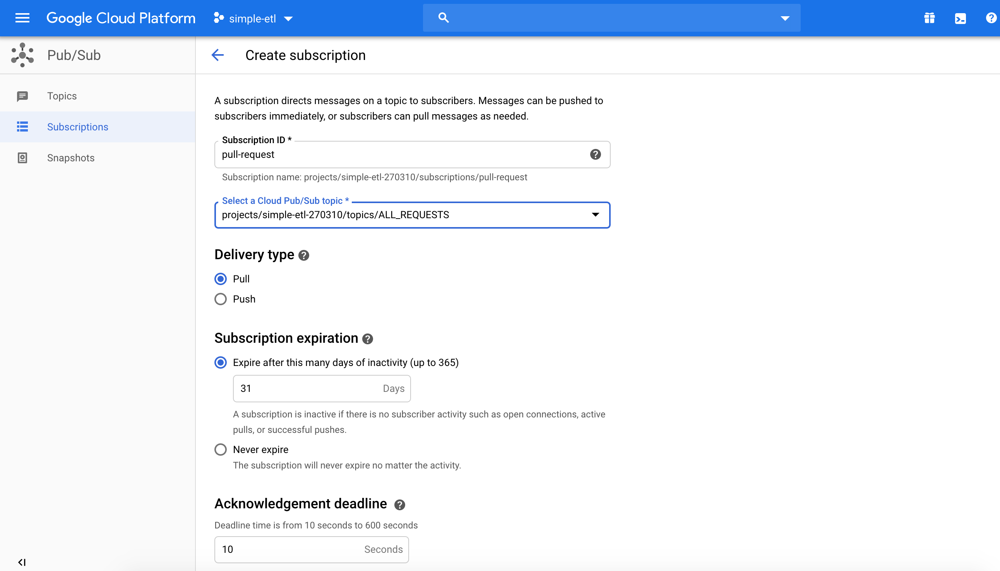
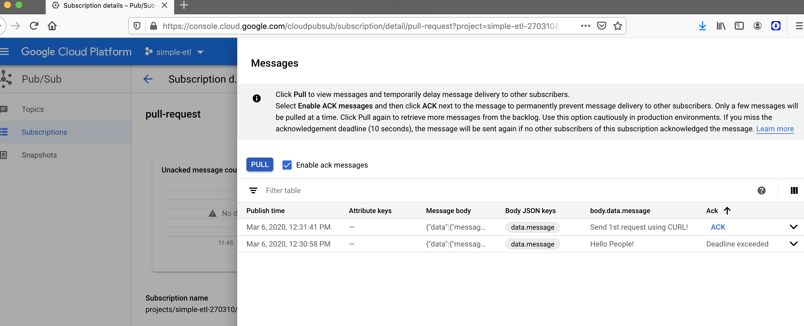
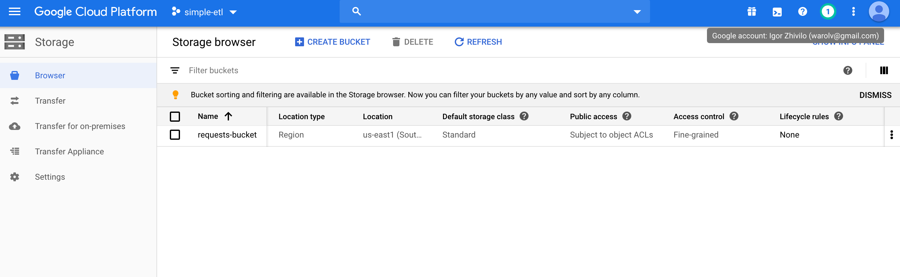
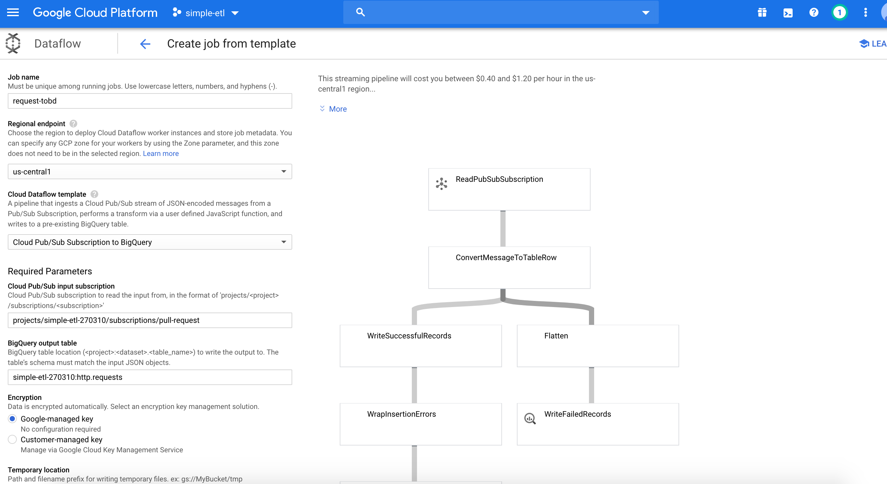
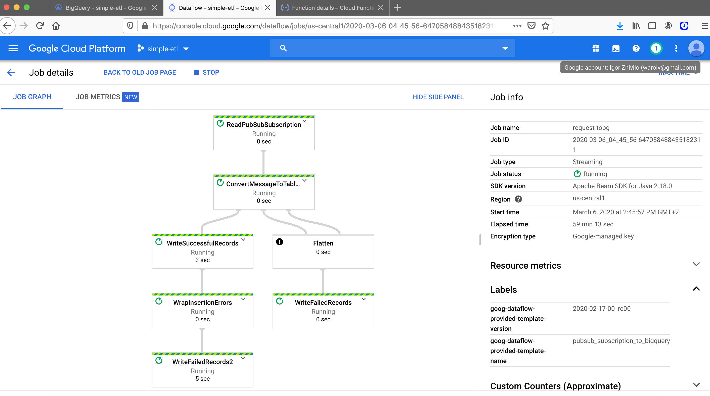
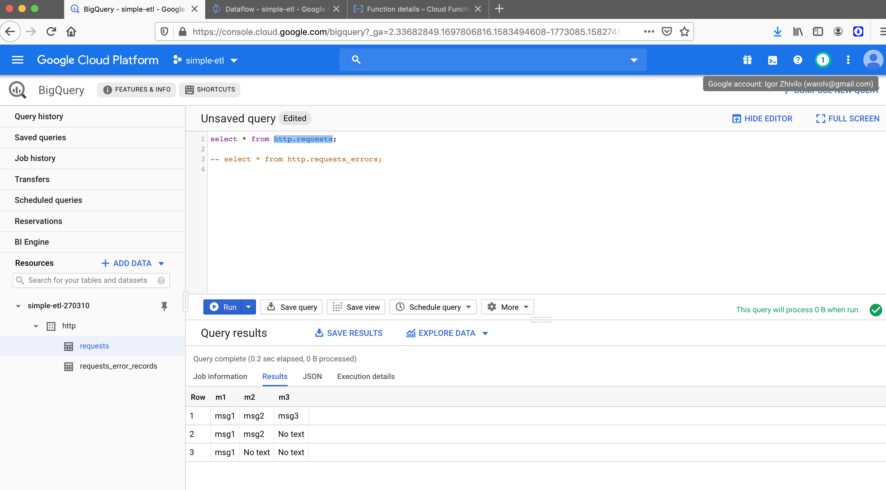

# Build a basic data "ETL" like, using GCP capabilities.

## Step 1 - HTTP server that listen to requests, get them as-is, and write them into google pubsub topic

1. Initialization of gcloud account - free tier and 'gcloud init' configuration in console.

2. Clone this repository:
  
        git clone https://github.com/warolv/simple_etl.git
        cd cloud-function

3. Create a Cloud Pub/Sub topic - 'ALL_REQUESTS':

        gcloud beta pubsub topics create ALL_REQUESTS

4. Deploy the publish function with an HTTP trigger:

        gcloud functions deploy publish --trigger-http --runtime nodejs8

5. Call the publish function: 

        gcloud functions call publish --data '{"topic":"ALL_REQUESTS","message":"Hello People!"}'

6. Send request with curl:

        curl -X POST "https://us-central1-simple-etl-270310.cloudfunctions.net/publish" -H "Content-Type:application/json" --data '{"topic":"ALL_REQUESTS","message":"Send 1st request using CURL!"}'

## Screenshots for step 1

## Problems I struggled with during first step

1. 'Cloud Function' deploy problems, a different errors caused but many changes I made to nodejs script

2. Debugging of pubsub to check if messages coming is not so obvious, I didn't saw a pull button at first on 'view messages'  

## Step 2 - Create a Dataflow job that reads from this topic subscription, and write it into bigquery table.

1. Create a dataset and table in BigQuery via google console
        
        Go console of big query, click on your project from left, then create dataset and create table
        in my case: http and requests

2. Create a storage bucket for dataflow streaming from pubsub to bigquery job

        Go to google console -> storage -> browser and add a new bucket

3. Create google dataflow job for streaming from pubsub to bigquery

4. Testing ETL

curl -X POST "https://us-central1-simple-etl-270310.cloudfunctions.net/publish" -H "Content-Type:application/json" --data '{"m1":"msg1"}'

curl -X POST "https://us-central1-simple-etl-270310.cloudfunctions.net/publish" -H "Content-Type:application/json" --data '{"m1":"msg1", "m2":"msg2"}'

curl -X POST "https://us-central1-simple-etl-270310.cloudfunctions.net/publish" -H "Content-Type:application/json" --data '{"m1":"msg1", "m2":"msg2", "m3":"msg3"}'

Result I see in bigquery:
        

## Problems I struggled with during second step

1. Created a dataflow job without a storage bucket which obviously not worked properly.
2. Not so easy debugging - when you sent a request with curl, but nothing comes to bigquery and you see messages in pubsub:

        * Looking through worker logs of dataflow job and job logs a bit helped.
        * Find out that 'requests_errors' table automatically created and updated with data which not pushed to regular table which is 'requests', then you can see actual error why data not pushed to needed table
3. After finding 'requests_errors' table I knew that data not actually coming in format I wanted - so I did changes in 'cloud function' and deployed it again.

